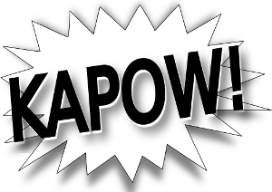

# The Campy Superhero Role-Playing Game

## Get the game

Everything you need to play the game is free to download 
[from the public project site](https://doctor-g.github.io/kapow).

## About this game

This game was created for [National Game Design Month
(NaGaDeMon)](http://nathanrussell.net/naga-demon/) 2019.

All the materials are licensed under 
[CC BY-NC-SA 4.0](https://creativecommons.org/licenses/by-nc-sa/4.0/).

## Contributing

### Changing the rules

You are welcome to clone this repository and hack this
game system to your heart's content as long as you
follow [the license](https://creativecommons.org/licenses/by-nc-sa/4.0/).

If you would like to suggest a change to the version of the files hosted here,
follow the [usual workflow for open source GitHub
projects](https://help.github.com/en/github/collaborating-with-issues-and-pull-requests).
That is, you may feel free to [open an issue](issues) or [submit a pull request](pulls).

### Building the files

The game files are designed in [LaTeX](https://www.latex-project.org/).
To configure an [Ubuntu](https://ubuntu.com/) system to build
the files, you should install the following packages:
- `texlive-latex-base`
- `texlive-latex-extra`
- `texlive-latex-recommended`
- `texlive-font-utils`

Running [`build.sh`](build.sh) will generate a set of PDF files from the LaTeX
sources.

Running [`deploy.sh`](deploy.sh) will rebuild the project and deploy the generated files 
to `gh-pages`.